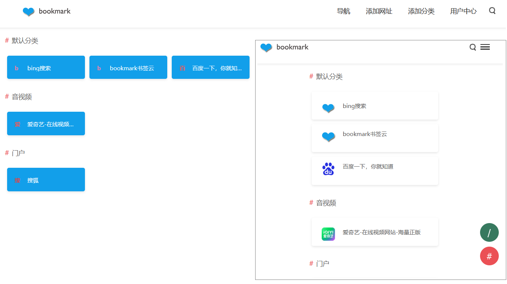

# bookmarkcloud
一个在线书签系统，功能简易，够用就行！

> 背景：想随时访问自己常用的网站，但是总是记不得或者不好找，由此开发该系统。

- 功能简单，主要通过AI和自己修改而来，使用php和sqlite，正是因为功能简单，无框架，自适应。
- 目前提供两个主题，可自行开发，放在themes文件夹下即可。
- 暂时没有时间优化，也不是程序员，暂时先这样了。
- 使用方法，修改重定向配置文件，放在服务器下，访问即可。

> 另：我有个域名bookmark.cloud 本来想自用，没精力，可出售（阿里云一口价，购买时改价格）。

 
